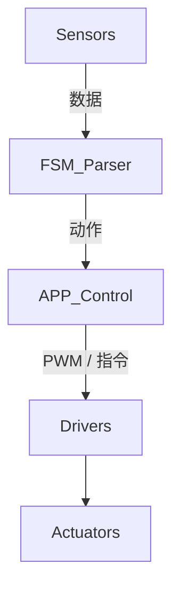
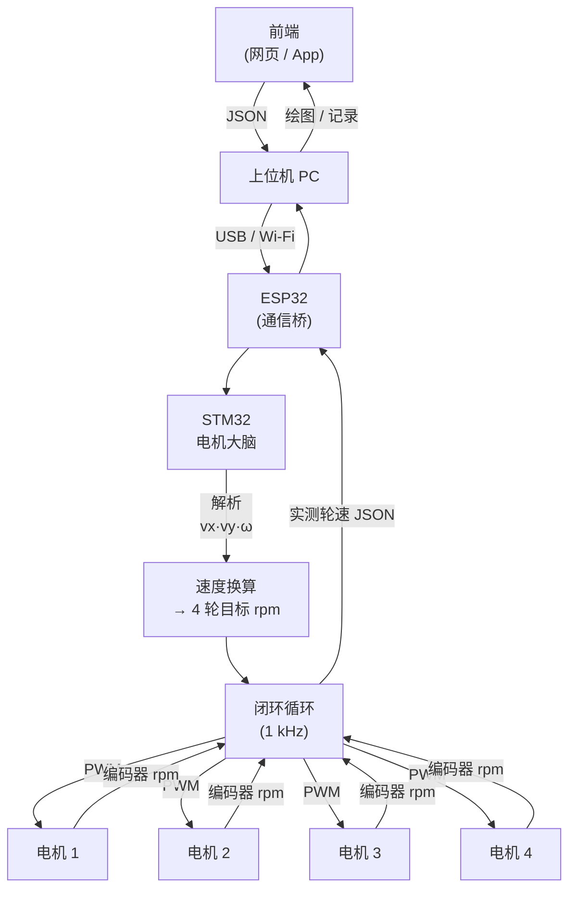
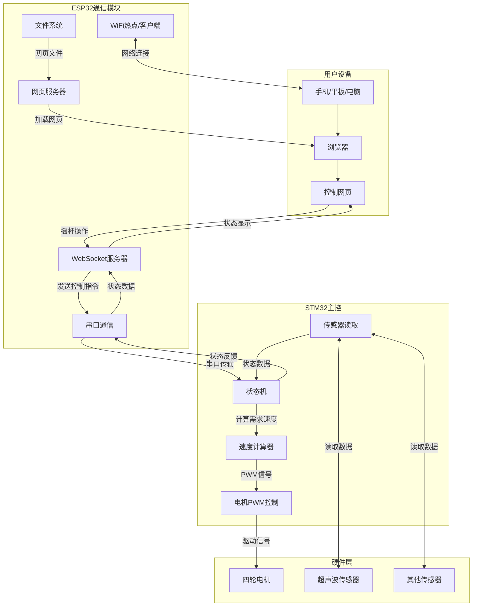

# STM32 机器人状态机框架（vx · vy · ω 版）

---

## 1 概述

基于 **JSON 规则** 的灵活状态机，所有底盘运动统一为三自由度速度向量 **(vx, vy, ω)**，其余架构保持向后兼容。

---

## 2 目录结构

```text
robot/
├── HARDWARE/
│   ├── FSM/                    # 状态机硬件抽象层
│   │   ├── fsm_parser.{h,c}    # 规则解析
│   │   ├── fsm_hardware.{h,c}  # 驱动适配
│   └── …                      # 其他硬件
├── APP/
│   └── Control/
│       ├── fsm_control.{h,c}   # 状态机调度
└── USER/
    └── main.c                 # 入口
```

---

## 3 关键特性

* **JSON 配置**：热加载状态/动作/条件。
* **三自由度底盘**：单一命令 `SET_CHASSIS_VEL` 即可完成所有移动；路径规划留给上位机。
* **抢占优先级**、**多传感器融合**、**异步动作**、**事件上报** —— 与旧版一致。

---

## 4 JSON 规则核心

```jsonc
{
  "script_ver": "YYYY-MM-DD-tag",
  "transitions": [
    {
      "id": "RULE_ID",
      "priority": 100,
      "state_in": [1, 3],
      "when": {"sensor": "SNR", "cmp": "<", "value": 10},
      "actions": [
        {"cmd": 9, "vx": 0, "vy": 0, "w": 0},
        {"cmd": 8, "name": "SAD"}
      ],
      "state_out": 2,
      "note": "说明文字"
    }
  ]
}
```

*条件表达式* 仍沿用原有原子 / 组合语法。

---

## 5 动作命令

| cmd   | 名称                | 主要参数        | 说明                     |
| ----- | ----------------- | ----------- | ---------------------- |
| **9** | SET\_CHASSIS\_VEL | vx, vy, w   | 三自由度速度 (m/s, rad/s)    |
| **0** | STOP\_ALL         | –           | 硬急停；= `9(0,0,0)` 但保留冗余 |
| **3** | SET\_MOTOR\_RAW   | m1‑m4       | 直通 PWM（调试用）            |
| 4     | SET\_LED          | r,g,b,count | RGB 灯                  |
| 5     | OLED\_TEXT        | text        | 文本显示                   |
| 6     | NRF\_SEND         | data        | 2.4 GHz 发送             |
| 7     | BEEP              | ms          | 蜂鸣器                    |
| 8     | OLED\_EMOJI       | name        | 表情                     |

> 旧版基于里程 / 角度的 `MOVE_CM`, `TURN_DEG` **已淘汰**。

---

## 6 状态报告

* 心跳 **HB**、事件 **EV**、动作 **AC**、警报 **AL** —— 协议不变。
* 当 `cmd = 9` 时，`AC` 追加 `vx / vy / w` 字段反馈。

---

## 7 软硬件集成

### 7.1 硬件接入



### 7.2 软件接口

```c
// 在 fsm_control.c
case CMD_SET_CHASSIS_VEL:
    Chassis_SetVelocity(act->vx, act->vy, act->w);
    break;
```

---

## 8 示例：避障小车

```jsonc
{
  "script_ver": "2025-07-09-simple",
  "transitions": [
    {
      "id": "STOP_BY_SONAR",
      "priority": 100,
      "state_in": [1],
      "when": {"sensor": "SNR", "cmp": "<", "value": 15},
      "actions": [{"cmd": 9, "vx": 0, "vy": 0, "w": 0}],
      "state_out": 2
    },
    {
      "id": "NORMAL_MOVE",
      "priority": 10,
      "state_in": [2],
      "when": {"op": "TRUE"},
      "actions": [{"cmd": 9, "vx": 0.3, "vy": 0.0, "w": 0.0, "async": true}],
      "state_out": 2
    }
  ]
}
```

---

## 9 动作数据流



在固件中，该链路由以下核心函数对应：

| 链路节点 | 关键函数 | 文件 |
| -------- | -------- | ---- |
| ESP → STM | 串口接收缓冲 & FSM_ParseJSON | fsm_control.c |
| 解析层 `vx·vy·ω` | Chassis_SetVelocity | APP/Control/chassis_solver.c |
| 速度换算 | SolveAndDrive (内部 static) | 同上 |
| PWM 输出 | FSM_HW_SetMotorRaw | Hardware/FSM/fsm_hardware.c |
| 轮速采集 | *TODO* Encoder_ReadRPM | – |
| JSON 回传 | FSM_Parser_SendHeartbeat / SendActionReport | Hardware/FSM/fsm_parser.c |

> `Chassis_Loop_Update()` 建议在 1 kHz 定时中断调用，实现闭环控制。

---

## 10 扩展指引

* **切换参考系**：在 `SET_CHASSIS_VEL` 增加 `mode` 字段（如 `field` / `body`）。
* **新增动作**：

  1. 在 `fsm_parser.{h,c}` 登记 `cmd` 常量。
  2. 在 `fsm_control.c` 添加处理分支。
  3. 在 `fsm_hardware.c` 实现底层逻辑。

---
好的，以下是从 **第11节 Wi‑Fi 设置** 开始的排版整理，保持风格一致、技术表达清晰、结构简洁：

---

## 11 Wi‑Fi 设置（Soft‑AP 配网）

---

### 11.1 环境准备

| 工具 / 库      | 版本 / 备注                                                |
| ----------- | ------------------------------------------------------ |
| Arduino IDE | ≥ 2.3.0                                                |
| ESP32 Core  | ≥ 2.0.16（Boards Manager 安装）                            |
| 必装库         | WiFiManager、ESPAsyncWebServer、AsyncTCP、AsyncElegantOTA |

**PlatformIO 安装示例：**

```bash
pio pkg install "ottowinter/ESPAsyncWebServer@^1.2.3"
pio pkg install "tzapu/WiFiManager"
```

---

### 11.2 编译与烧录

#### Arduino IDE 设置：

* 工具 → 开发板 → ESP32 Dev Module
* Flash Size → 4 MB (1.2 MB APP / 1.5 MB OTA / 0.5 MB SPIFFS)
* Upload Speed → 921600
* 点击 ▶ Upload 上传

#### PlatformIO：

```bash
pio run -t upload -e esp32dev
```

---

### 11.3 首次配网流程

1. 上电后，ESP32 检测无保存凭据，自动进入配网模式；
2. 创建热点 **CarConfig\_AP**，密码 **12345678**；
3. 手机连接热点，浏览器自动跳转到配置页（WiFiManager Portal）；
4. 选择家庭 Wi‑Fi 并输入密码 → 点击 Save；
5. 成功后设备重启并连接路由；
6. ESP32 通过 UART2 向 STM32 发送：

```json
{"ip":"192.168.1.73", "ssid":"MyHomeAP"}\n
```

> 若 8 秒内连网失败，模块保留 AP 热点供重新配置。

---

### 11.4 修改默认热点信息

在 `main.cpp` 中修改：

```cpp
#define HOST_AP_SSID  "CarConfig_AP"
#define HOST_AP_PASS  "12345678"
wm.autoConnect(HOST_AP_SSID, HOST_AP_PASS);
```

---

## 12 网页控制小车（摇杆模式）

---

### 12.1 文件系统结构（LittleFS）

```
data/
 ├── index.html        # 默认重定向到 /joystick.html
 ├── joystick.html     # 摇杆控制页面
 ├── js/
 │    └── nipple.min.js
 └── app.js            # 主逻辑
```

上传：Arduino IDE → 工具 → ESP32 Data Upload

---

### 12.2 前端核心逻辑（`app.js`）

```js
const ws = new WebSocket(`ws://${location.host}/ws`);
const joy = nipplejs.create({ zone: document.getElementById('pad'), threshold: 0.1 });
let last = 0;

joy.on('move', (_, d) => {
  if (Date.now() - last < 50) return;  // 控制频率为 20 Hz
  last = Date.now();
  const vx = +(-d.vector.y * 0.4).toFixed(2);
  const vy = +( d.vector.x * 0.4).toFixed(2);
  const w  = +((d.angle.radian || 0) * 0.3).toFixed(2);
  ws.send(`${vx},${vy},${w}`);
});
```

---

### 12.3 ESP32 WebSocket 服务端

```cpp
#include <WebSocketsServer.h>
WebSocketsServer ws(81);

void onWsEvent(uint8_t id, WStype_t type, uint8_t *pl, size_t len){
  if (type == WStype_TEXT){
    Serial2.write(pl, len);
    Serial2.write('\n');
  }
}

void setupSocket(){
  ws.onEvent(onWsEvent);
  ws.begin();
}
```

> STM32 端以 `\n` 为帧尾，用 `sscanf("%f,%f,%f", ...)` 解析。

---

## 13 双重 OTA 模块

---

### 13.1 ESP32 自升级（AsyncElegantOTA）

```cpp
#include <AsyncElegantOTA.h>
server.on("/update", HTTP_GET, [](auto *req){
  req->send(LittleFS, "/update.html");
});
AsyncElegantOTA.begin(&server);  // 浏览器访问 /update 页面
```

---

### 13.2 STM32 OTA 刷固件（/ota\_stm32）

1. 浏览器向 `/ota_stm32` POST 上传 `.bin`；
2. ESP32 存储到 LittleFS（或边收边发）；
3. 拉高 `BOOT0_PIN` → 复位，STM32 进入 Bootloader；
4. 调用 `flashYmodem(file)` 刷写；
5. 烧录完毕 → 复位 → 返回 JSON：

```json
{"ok": true}
```

> YMODEM 示例位于 `lib/ymodem/ymodem.cpp`，默认波特率 115200。

---

## 14 STM32 串口协议

---

| 类型    | 格式                         | 说明                       |
| ----- | -------------------------- | ------------------------ |
| IP 通知 | `{ip:"x.x.x.x",ssid:"AP"}` | ESP32 → STM32，连网后发送      |
| 控制命令  | `vx,vy,w\n`                | 浏览器 → ESP32 → STM32 控制小车 |

> STM32 使用 DMA + 环形缓冲区，遇 `\n` 解析一帧数据。

---
