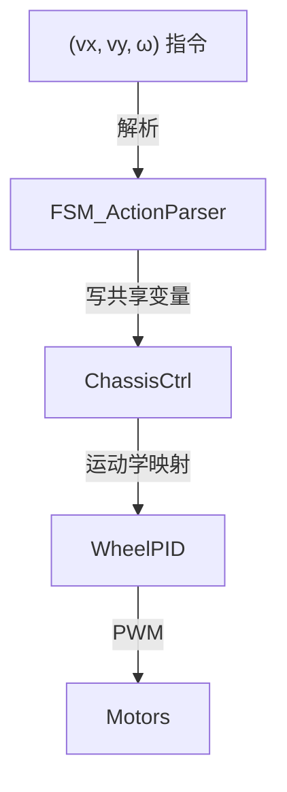

# STM32 机器人状态机框架（vx · vy · ω 版）

---

## 1 概述

基于 **JSON 规则** 的灵活状态机，所有底盘运动统一为三自由度速度向量 **(vx, vy, ω)**，其余架构保持向后兼容。

---

## 2 目录结构

```text
robot/
├── HARDWARE/
│   ├── FSM/                    # 状态机硬件抽象层
│   │   ├── fsm_parser.{h,c}    # 规则解析
│   │   ├── fsm_hardware.{h,c}  # 驱动适配
│   └── …                      # 其他硬件
├── APP/
│   └── Control/
│       ├── fsm_control.{h,c}   # 状态机调度
└── USER/
    └── main.c                 # 入口
```

---

## 3 关键特性

* **JSON 配置**：热加载状态/动作/条件。
* **三自由度底盘**：单一命令 `SET_CHASSIS_VEL` 即可完成所有移动；路径规划留给上位机。
* **抢占优先级**、**多传感器融合**、**异步动作**、**事件上报** —— 与旧版一致。

---

## 4 JSON 规则核心

```jsonc
{
  "script_ver": "YYYY-MM-DD-tag",
  "transitions": [
    {
      "id": "RULE_ID",
      "priority": 100,
      "state_in": [1, 3],
      "when": {"sensor": "SNR", "cmp": "<", "value": 10},
      "actions": [
        {"cmd": 9, "vx": 0, "vy": 0, "w": 0},
        {"cmd": 8, "name": "SAD"}
      ],
      "state_out": 2,
      "note": "说明文字"
    }
  ]
}
```

*条件表达式* 仍沿用原有原子 / 组合语法。

---

## 5 动作命令

| cmd   | 名称                | 主要参数        | 说明                     |
| ----- | ----------------- | ----------- | ---------------------- |
| **9** | SET\_CHASSIS\_VEL | vx, vy, w   | 三自由度速度 (m/s, rad/s)    |
| **0** | STOP\_ALL         | –           | 硬急停；= `9(0,0,0)` 但保留冗余 |
| **3** | SET\_MOTOR\_RAW   | m1‑m4       | 直通 PWM（调试用）            |
| 4     | SET\_LED          | r,g,b,count | RGB 灯                  |
| 5     | OLED\_TEXT        | text        | 文本显示                   |
| 6     | NRF\_SEND         | data        | 2.4 GHz 发送             |
| 7     | BEEP              | ms          | 蜂鸣器                    |
| 8     | OLED\_EMOJI       | name        | 表情                     |

> 旧版基于里程 / 角度的 `MOVE_CM`, `TURN_DEG` **已淘汰**。

---

## 6 状态报告

* 心跳 **HB**、事件 **EV**、动作 **AC**、警报 **AL** —— 协议不变。
* 当 `cmd = 9` 时，`AC` 追加 `vx / vy / w` 字段反馈。

---

## 7 软硬件集成

### 7.1 硬件接入


### 7.2 软件接口

```c
// 在 fsm_control.c
case CMD_SET_CHASSIS_VEL:
    Chassis_SetVelocity(act->vx, act->vy, act->w);
    break;
```

---

## 8 示例：避障小车

```jsonc
{
  "script_ver": "2025-07-09-simple",
  "transitions": [
    {
      "id": "STOP_BY_SONAR",
      "priority": 100,
      "state_in": [1],
      "when": {"sensor": "SNR", "cmp": "<", "value": 15},
      "actions": [{"cmd": 9, "vx": 0, "vy": 0, "w": 0}],
      "state_out": 2
    },
    {
      "id": "NORMAL_MOVE",
      "priority": 10,
      "state_in": [2],
      "when": {"op": "TRUE"},
      "actions": [{"cmd": 9, "vx": 0.3, "vy": 0.0, "w": 0.0, "async": true}],
      "state_out": 2
    }
  ]
}
```

---

## 9 动作数据流



---

## 10 扩展指引

* **切换参考系**：在 `SET_CHASSIS_VEL` 增加 `mode` 字段（如 `field` / `body`）。
* **新增动作**：

  1. 在 `fsm_parser.{h,c}` 登记 `cmd` 常量。
  2. 在 `fsm_control.c` 添加处理分支。
  3. 在 `fsm_hardware.c` 实现底层逻辑。

---

MIT License
