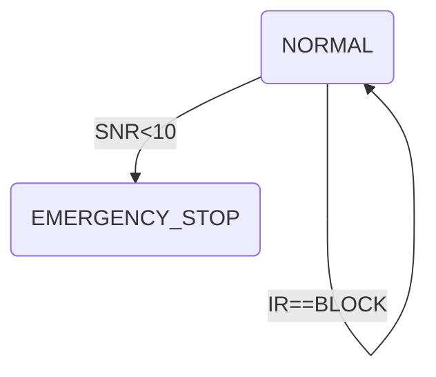
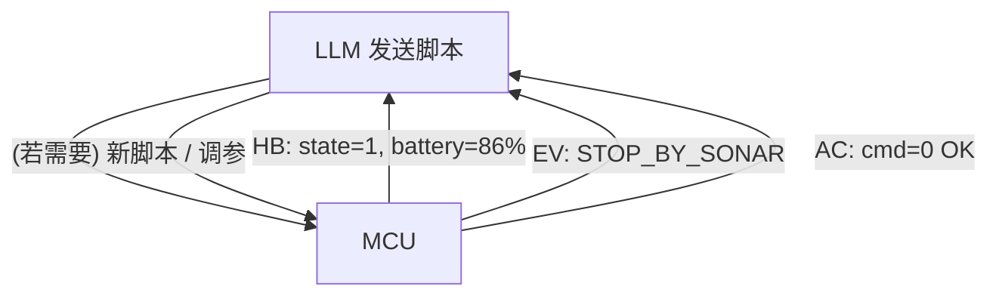

下面用 **“能一眼看懂的小白科普”** + **Mermaid `graph TD`** 流程图，把 *LLM→MCU 脚本* 和 *MCU→LLM 回报* 讲成两幅漫画式的场景。只保留最核心的字段，让你一看就会用。把下列代码块直接粘到支持 Mermaid 的 Markdown 编辑器（如 GitHub、Obsidian、Typora）就能看到流程图。

---

## 1️⃣ LLM 发脚本 —— “如果……就干啥”

### 🌰 场景：

> **机器人小车**平时巡航，
> ——如果**超声波距离 < 10 cm**👉立刻**急停**；
> ——如果**红外前面被挡**, **先左转再前进 15 cm**。

### ⬇️ 最小 JSON（仅 2 条规则 + 1 条兜底）

```jsonc
{
  "schema": "fsm_v1",
  "transitions": [
    { "id":"STOP_BY_SONAR",
      "priority": 100,
      "state_in": [1],              // 只在 NORMAL 状态下监听
      "when": "SNR<10",
      "actions": [ {"cmd":0} ],     // 0=停机
      "state_out": 2                // 跳到 EMERGENCY_STOP
    },
    { "id":"AVOID_IR",
      "priority": 50,
      "state_in": [1],
      "when": "IR==BLOCK",
      "actions": [ {"cmd":6}, {"cmd":4,"p1":15} ],
      "state_out": 1
    }
  ],
  "fallback": { "actions":[{"cmd":0}], "state_out":2 }
}
```

### 🖼️ 用 `graph TD` 画出状态机



解释：

* **节点**=状态（1 正常，2 急停）
* **箭头**=满足 `when` 后的跃迁
* **priority** 谁大谁先抢占。

---

## 2️⃣ MCU 回报 —— “我做了啥&结果如何”

### ✉️ 三封小信

| 信封类型        | 何时寄出   | 里面写啥（核心字段）                          |
| ----------- | ------ | ----------------------------------- |
| **HB** 心跳   | 每秒寄一次  | `state`、电量、CPU、队列长度                 |
| **EV** 事件   | 条件被触发  | `event_id`、`state_in→state_out`、触发值 |
| **AC** 动作报告 | 每条动作收尾 | `seq_id`、`cmd`、`result`、耗时          |

> 小带宽环境：只寄 **HB** + **AC** 就够了，真正故障时再寄 **ALERT**。

### 🖼️ 信息往返的流水线



---

## 3️⃣ 为什么这样设计就够用了？

1. **脚本只关心三件事**

   * *在哪些状态* (`state_in`)
   * *触发条件* (`when`)
   * *干哪些动作然后去哪* (`actions`,`state_out`)

2. **回报也只分三类**

   * 我**活着**（HB）
   * 我**为什么要干**这事（EV）
   * 我**干完了**结果怎样（AC）

3. **优先级抢占** + **状态跳转** = 把“紧急刹车”永远放在最前。

> 这就像红绿灯：
>
> * **规则**=红灯亮→停车，绿灯亮→走；
> * **回报**=小车告诉后台“我看到红灯，已经停下来了”，后台继续规划下一步。

---
### MCU → LLM 回报 · 3 条**完整示例报文**

> **默认链路**：一帧 = 帧头 + `payload`（下面就是 payload 部分，纯 JSON）。
> **字段**都来自你要求的「最小子集」——能证明“为什么触发 → 做了什么 → 做得怎样”。

---

#### 1️⃣ Heartbeat (HB) —— “我活着”

```json
{
  "type": "HB",
  "seq": 6152,
  "tick": 23145678,        // MCU 开机毫秒计数
  "state": 1,              // NORMAL
  "battery": 86,           // %
  "cpu": 24,               // %
  "queue": 2               // 剩余动作条数
}
```

* **发送频率**：1 Hz（可在订阅表里改）。

---

#### 2️⃣ Event (EV) —— “为什么要干这事”

```json
{
  "type": "EV",
  "seq": 6153,
  "event_id": "STOP_BY_SONAR",
  "state_in": 1,
  "state_out": 2,
  "cause": {
    "SNR": 8.6              // cm，刚好小于 10
  },
  "ts": 23145702            // 触发时间戳（ms）
}
```

* 一看到超声波 < 10 cm 就马上发；
* **event\_id** 对应脚本里的 `transition.id`，LLM 一秒就能定位是哪条规则命中。

---

#### 3️⃣ Action Report (AC) —— “我干完了”

```json
{
  "type": "AC",
  "seq": 6154,
  "seq_id": 0x1A3F,        // 该动作在 MCU 队列里的唯一编号
  "cmd": 0,                // 停机
  "result": "OK",          // 失败时 = "FAIL"
  "t_start": 23145703,
  "t_end":   23146135,
  "delta": {               // 实际效果
    "wheel_pwm_ms": 430,   // 电机维持高电平的总时长
    "dist_cm": 0.0         // 真正前进距离（停机动作理应为 0）
  }
}
```

* **result = FAIL** 时可再加 `err_code`；
* LLM 用 `(t_end-t_start)` 对比预估 `eta_ms`，做性能评估。

---

#### （可选）Alert (AL) —— “出事啦！”

```json
{
  "type": "AL",
  "seq": 6155,
  "alert_code": "LOW_BATT",
  "detail": { "battery": 14 },
  "ts": 23146200
}
```

* 只有故障或安全边缘才发；LLM 或上位机据此紧急处理。

---

##### 🚀 信息链路一目了然

```mermaid
graph TD
    LLM["LLM<br><small>(规划)</small>"] <-- HB 6152<br>EV 6153<br>AC 6154 -- MCU
    LLM -->|新脚本 / 调参| MCU
```

> ✅ 这样，LLM **先收 EV** 知道“什么规则触发”，
> ✅ **再收 AC** 知道“动作是否成功”，
> ✅ **持续收 HB** 监控健康状态——
> **三条信息就把整个闭环交代清楚。**

把这三份 JSON 当模板，直接在代码里 `printf()`／`cbor_encode()` 就能发，调试也一眼能看懂。祝接入顺利!

### 📌 使用步骤小抄

1. **LLM 端**：写好 JSON → 串口/BLE/Wi-Fi 发给 MCU。
2. **MCU 端**：解析后放进 **transition 表**。
3. 每个循环：

   * 读取传感器，检查 `when` → 抢占执行动作
   * 动作完毕 → 上报 AC
   * 周期性 → 上报 HB
4. **LLM 端**：收到 AC / HB，判断需不需要下一个脚本。

就这么简单，先跑通最小闭环，再慢慢加并行动作、签名加密、掉电恢复等进阶特性。祝你和同事都能轻松看懂、快速上手!
